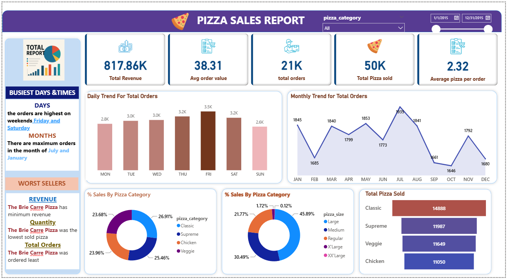

# 🍕 Pizza Sales Dashboard Project

An end-to-end data analytics project to analyze pizza sales and uncover insights using **SQL** and **Power BI**. This project focuses on answering key business questions such as revenue trends, best-selling pizzas, and customer behavior patterns.

---

## 📊 Key Insights

- 📈 **Total Revenue**: ₹817.86K  
- 🍕 **Total Pizzas Sold**: 50,000+  
- 🧾 **Total Orders**: 21,000+  
- 💸 **Average Order Value**: ₹38.31  
- 🧮 **Average Pizzas Per Order**: 2.32

---

## 📁 Project Structure
pizza-sales-dashboard/
├── data/
│ └── pizza_sales.csv # Raw dataset
│
├── queries/
│ ├── kpi_queries.sql # KPIs: revenue, orders, avg value
│ └── eda_queries.sql # EDA: busiest days, pizza category/size sales
│
├── dashboard/
│ └── pizza_dashboard.pbix # Power BI dashboard file
│
├── images/
│ ├── dashboard_overview.png # Full dashboard screenshot
│ ├── kpi_metrics.png # Revenue, orders, avg values
│ └── category_size_sales.png # Donut charts, total pizza sold
│
└── README.md

## 🛠️ Tools & Technologies Used

- **SQL** (MySQL or compatible engine)  
- **Power BI** (for dashboard visualization)  
- **CSV** (as the raw data source)  
- **DAX** (for calculated metrics, if used)

---

## 🔍 Business Questions Answered

- What are the busiest days and months for pizza orders?
- What is the average order value and quantity?
- Which pizza categories and sizes are most/least popular?
- Which pizzas are the top sellers and worst performers?

---

## 📈 Dashboard Preview

### 🖥️ Full Dashboard Overview

### 📊 KPIs & Totals

### 🍕 Sales by Category & Size

---

## 📌 How to Use

1. Clone this repository  
2. Open `dashboard/pizza_dashboard.pbix` in Power BI Desktop  
3. Load the dataset from `data/pizza_sales.csv`  
4. Explore the dashboard or modify visuals as needed  
5. Run SQL queries from `queries/` folder for backend analysis

---

## 🎯 Use Cases

- Academic/portfolio project for analytics and BI roles  
- Interview-ready case study  
- Practice for SQL + Power BI integration  
- Data storytelling using real-world KPIs

---

## 🙋‍♂️ Author

Made with 💻 by [Aman Singh](https://github.com/AmanSingh9918)  
If you found this helpful, feel free to ⭐ star the repo or fork it!
